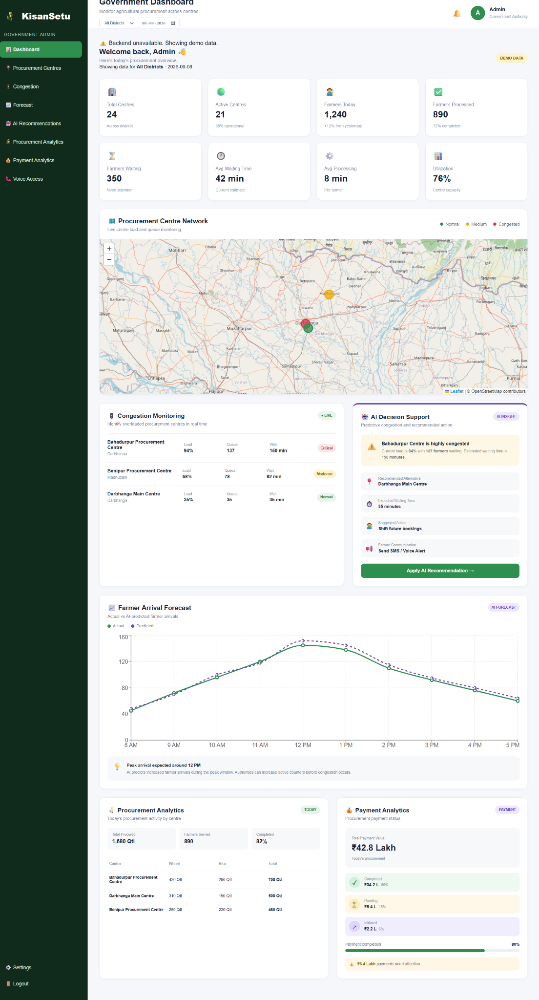

# 🌾 KisanSetu

> **AI-Powered Agricultural Procurement Queue & Intelligence Platform**

[](#) [](#) [](#) [](#) [](#) [](#)

KisanSetu is a prototype platform designed to reduce **farmer waiting time, procurement uncertainty, and lack of real-time information** during agricultural procurement.

Instead of making farmers physically wait to find out what is happening, KisanSetu aims to give them information **before they wait** through digital slots, tokens, queue visibility, procurement tracking, payment status, and voice assistance.

For government authorities, KisanSetu acts as an **intelligence and operational layer** around the procurement workflow, providing centre monitoring, congestion insights, farmer-arrival forecasting, and recommended actions.

---

## 🎯 Problem

Farmers may face:

- Long waiting times at procurement centres
- Uncertainty about procurement schedules
- Lack of visibility into queue position
- Repeated visits to procurement centres
- Uncertainty around procurement and payment status
- Difficulty using complex digital systems
- Limited access to smartphones or continuous internet connectivity

### Our core idea

> **"Don't make farmers wait for information. Give them information before they wait."**

---

## 💡 Solution

KisanSetu connects three stakeholders:

```text
                         KISANSETU
                            │
          ┌─────────────────┼─────────────────┐
          │                 │                 │
          ▼                 ▼                 ▼
       FARMER           OPERATOR           GOVERNMENT
       APP              DASHBOARD          ADMIN
          │                 │                 │
          └─────────────────┼─────────────────┘
                            ▼
                    PROCUREMENT WORKFLOW
                            │
                            ▼
                    INTELLIGENCE LAYER
                            │
              ┌─────────────┼─────────────┐
              ▼             ▼             ▼
          Waiting-Time   Congestion     Demand
          Prediction     Prediction     Forecast
```

### Farmer journey

```text
Registration → Add Produce → Nearby Centres → Recommendation
→ Slot Booking → Digital Token → Live Queue
→ Procurement Tracking → Payment Tracking
```

### Government journey

```text
Centre Monitoring → Congestion Detection → Prediction
→ AI Decision Support → Recommended Action → Farmer Communication
```

---

## ✨ Key Features

### 👨‍🌾 Farmer Application

- Farmer registration and login UI
- Add produce and quantity
- Nearby procurement centre discovery
- Smart recommendation interface
- Slot booking
- Digital token generation
- Live queue tracking
- Estimated waiting time
- Procurement status tracking
- Payment status tracking
- Notifications
- English / Hindi language support
- Voice assistance demo
- Simple farmer-friendly interface

### 🏢 Procurement Operator

The architecture includes a dedicated operator workflow for:

- Viewing farmer bookings
- Managing tokens
- Calling the next farmer
- Updating queue state
- Updating procurement stages
- Supporting centre-level operations

### 🏛️ Government / Admin Intelligence Dashboard

- Government-level overview
- Procurement centre network map
- Centre congestion monitoring
- Queue and waiting-time visibility
- Farmer arrival forecasting
- AI decision-support panel
- Procurement analytics
- Payment analytics
- Centre utilization indicators
- Voice access section
- District-level monitoring concept

---

## 🤖 AI / Intelligence Layer

KisanSetu is designed around four major intelligence use cases.

### 1. Waiting-Time Prediction

Potential inputs:

- Current queue length
- Active counters
- Historical service time
- Time of day
- Day of week
- Centre utilization
- Upcoming bookings

Example:

```text
Queue:              86 farmers
Active counters:    3
Estimated wait:     132 minutes
Risk:               HIGH
```

### 2. Centre Congestion Prediction

The system can identify centres that are currently overloaded or likely to become congested.

```text
Centre: Bahadurpur
Current load: 94%
Queue: 137
Estimated wait: 160 min
Risk: HIGH
```

### 3. Smart Slot / Centre Recommendation

The recommendation should consider more than distance:

```text
Distance + Current Queue + Predicted Waiting Time
+ Slot Availability + Centre Capacity
```

> **The nearest centre is not always the best centre.**

### 4. Farmer Arrival Forecasting

The government dashboard can visualize expected farmer arrivals by time of day to support:

- Counter planning
- Staff planning
- Slot distribution
- Congestion prevention

---

## 🧠 Why KisanSetu is Different

KisanSetu is **not intended to replace existing government procurement systems**.

Existing procurement ecosystems are important for registration, procurement transactions, reporting, and payment-related workflows.

KisanSetu focuses on the operational and intelligence gap around the farmer journey.

### Existing workflow

```text
Record → Process → Report
```

### KisanSetu intelligence layer

```text
Monitor → Detect → Predict → Recommend → Inform → Act
```

> **"Existing systems record what happened. KisanSetu helps predict what happens next and what action can be considered."**

---

## 📊 Admin Dashboard

The government dashboard is designed to answer:

> **Where is the problem now, where could it occur next, why is it happening, and what action can be considered?**

### Dashboard modules

| Module | Purpose |
|---|---|
| KPI Overview | Monitor overall procurement operations |
| Centre Network | Geographical centre visibility |
| Congestion Monitoring | Identify overloaded centres |
| AI Decision Support | Show predicted risks and recommendations |
| Arrival Forecast | Anticipate farmer demand |
| Procurement Analytics | Monitor procurement activity |
| Payment Analytics | Monitor payment status |
| Voice Access | Support voice-based information access |

### Dashboard screenshot



---

## 📞 Voice Assistance

KisanSetu includes a bilingual voice-assistance prototype.

The current demo provides information for:

1. 🎫 Token Status
2. 🚶 Queue Status
3. 🌾 Procurement Status
4. 💰 Payment Status

The prototype demonstrates:

```text
English Browser Voice → Hindi Pre-generated Audio → Farmer Information
```

For production deployment, this interface can be connected to a proper telephony / IVR service.

---

## 🌐 Accessibility & Low Digital Literacy

KisanSetu does not assume that every farmer has the same level of digital literacy.

```text
Smartphone → Farmer App
Basic Phone → SMS
Low Digital Literacy → Voice / IVR
Low Connectivity → Cached Information + SMS / Voice
```

> **"We are not designing only for a smartphone user; we are designing for a farmer."**

---

## 🏗️ Technology Stack

### Frontend

- React
- Vite
- JavaScript
- CSS
- React Router
- Axios

### Backend Architecture

- Python
- FastAPI
- REST APIs
- SQLAlchemy
- MySQL

### Intelligence / ML Layer

Designed for:

- Waiting-time prediction
- Congestion prediction
- Centre / slot recommendation
- Demand forecasting

### Deployment

- GitHub
- Vercel

---

## 📁 Project Structure

```text
KisanSetu/
├── frontend/
│   ├── admin/
│   ├── farmer/
│   │   ├── public/audio/
│   │   └── src/
│   └── operator/
├── backend/
│   ├── app/
│   ├── requirements.txt
│   └── .env
├── ai/
├── database/
├── docs/
└── README.md
```

---

## 🚀 Getting Started

### Prerequisites

- Node.js 18+
- npm
- Python 3.x
- Git
- MySQL (for backend integration)

### Clone

```bash
git clone https://github.com/abhinav25005229-creator/KisanSetu.git
cd KisanSetu
```

### Farmer Frontend

```bash
cd frontend/farmer
npm install
npm run dev
```

Production build:

```bash
npm run build
```

### Admin Frontend

```bash
cd frontend/admin
npm install
npm run dev
```

Production build:

```bash
npm run build
```

### Backend

```bash
cd backend
python -m venv .venv
```

Windows:

```powershell
.venv\Scripts\activate
```

Install:

```bash
pip install -r requirements.txt
```

Run:

```bash
python -m uvicorn app.main:app --reload
```

Backend:

```text
http://localhost:8000
```

API docs:

```text
http://localhost:8000/docs
```

> **Prototype note:** The currently deployed prototype primarily demonstrates the frontend workflow using representative/demo data. Live backend, database, and production ML integration are separate integration layers.

---

## 🔌 API Contract

Planned backend API surface:

```text
POST /auth/login
POST /auth/register

GET  /centres/nearby
GET  /centres/{id}/slots

POST /bookings
GET  /bookings/{id}

GET  /queue/{token}

GET  /procurement/{id}
GET  /payments/{id}

GET  /ai/wait-time
GET  /ai/recommend-slot
```

---

## 🌐 Live Demo

### Farmer Application

**https://kisansetu-farmer.vercel.app/**

Flow:

```text
Login → Add Produce → Nearby Centres → AI Recommendation
→ Slot Booking → Digital Token → Live Queue
→ Procurement → Payment
```

### Government Admin Dashboard

**https://kisansetu-admin-4u2niptdt-orbit-ced2.vercel.app/**

Flow:

```text
Admin Login → Government Dashboard → Centre Network
→ Congestion Monitoring → AI Decision Support
→ Arrival Forecast → Procurement Analytics → Payment Analytics
```

---

## 🎬 Recommended SIH Demo

1. **Farmer:** Produce → Centre → Recommendation → Slot → Token
2. **Queue:** Token → Farmers Ahead → Estimated Wait → Live Queue
3. **Procurement:** Quality Verification → Procurement → Payment
4. **Government:** Centre Network → Congestion → Forecast → AI Decision Support
5. **Voice:** Token → Queue → Procurement → Payment

---

## 🔐 Security Approach

For production implementation:

- JWT-based authentication
- Role-based access control
- Password hashing
- HTTPS
- Input validation
- Protected API routes
- Least-privilege database access
- Farmer-specific data access
- Operator centre-level authorization
- Admin authority-scoped access

Backend authorization should be enforced independently of frontend route protection.

---

## 📈 Expected Impact

Target metrics include:

- Average farmer waiting time
- Queue length
- Centre utilization
- Farmer processing rate
- Repeat visits
- Slot utilization
- Congestion duration
- Procurement-status transparency
- Payment-status transparency

```text
Less Uncertainty
      ↓
Better Planning
      ↓
Less Waiting
      ↓
Better Centre Utilization
      ↓
Better Farmer Experience
```

---

## 🧪 Prototype Status

### Currently demonstrated

- Farmer UI workflow
- Government/Admin dashboard
- Procurement centre visualization
- Congestion monitoring UI
- AI decision-support UI
- Arrival forecast visualization
- Procurement analytics
- Payment analytics
- Hindi / English UI foundation
- Voice assistance prototype
- Vercel deployment

### Next integration phase

- Live database integration
- Production authentication
- Real booking/token APIs
- Live queue updates
- Production ML models
- SMS gateway
- Telephony / IVR integration
- Offline synchronization

> The current prototype intentionally uses representative/demo data. Production claims should be made only after backend and ML validation.

---

## 🏆 Design Philosophy

### 1. Farmer First
Simple flows over complicated forms.

### 2. Predict Before Congestion
Identify future bottlenecks instead of reacting only after queues become large.

### 3. Inform Before the Farmer Travels
Give farmers useful information before they spend time and money reaching a centre.

### 4. Decision Support, Not Autonomous Decisions
AI assists government officials; final decisions remain with authorized personnel.

### 5. Integration, Not Duplication
KisanSetu is designed as an intelligence layer around the existing procurement ecosystem rather than another isolated procurement database.

---

## 👥 Team

**KisanSetu — SIH 2026**

- **Member 1 — Farmer Frontend**
- **Member 2 — Procurement Centre Operator Dashboard**
- **Member 3 — Government/Admin Intelligence Dashboard & Team Lead**
- **Member 4 — Backend / FastAPI / Database / Authentication**
- **Member 5 — AI/ML**
- **Member 6 — Integration / Testing / Deployment**

---

## 💬 Key Message

> ### "Don't make farmers wait for information. Give them information before they wait."

KisanSetu aims to transform agricultural procurement from a **reactive, uncertain queue experience** into a **predictable, transparent and intelligence-assisted journey**.

---

## 📄 License

This project was developed as a Smart India Hackathon prototype.

---

## 🙏 Acknowledgements

Built for **Smart India Hackathon 2026** and focused on the agricultural procurement challenge addressed by the project team.
